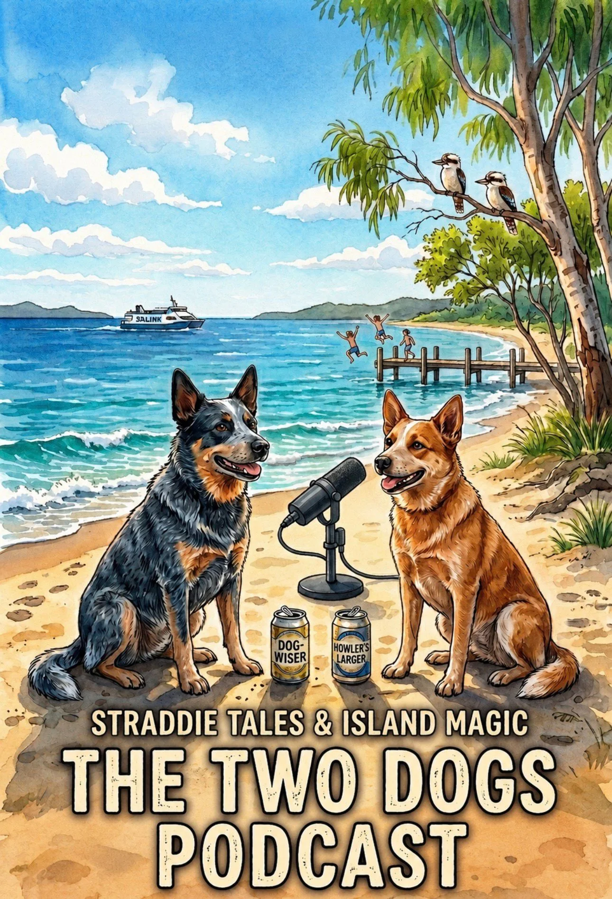

# Two Dogs Podcast Backend

Public planning repo and GitHub Pages workbench for the Two Dogs Podcast.

This is a public-facing planning bench where interactive feedback forms generate agent-ready Markdown files for episodes, scenes, guest notes, guest-chosen spirit animal characters, ad ideas, source references and simple handoffs.

Public home: [Two Dogs Podcast Planning](https://auraofintelligence.github.io/two-dogs-podcast-backend/)

Show rhythm menu: [Regular Show Bits](https://auraofintelligence.github.io/two-dogs-podcast-backend/recurring-scenes.html)

Micro scene pipeline: [Micro Scenes Builder](https://auraofintelligence.github.io/two-dogs-podcast-backend/builders/micro-scenes.html)

Backlink: [Film Club World](https://auraofintelligence.github.io/strange-but-true/film-club-world.html)

## Premise

Two animated CGI/AI dogs host the show.

- Angel is Blue Dog / Blue Heeler.
- Blue Dog is present as co-host, but Angel directs Blue Dog's voice, prompts, tone and decisions.
- Luke is Red Dog / Red Heeler.
- Guests choose their own spirit animal character and nickname.
- The show can turn real conversations into animated scenes, local set pieces, banter, music bits, sponsor reads and future film-club experiments.

## Working Rule

Keep it exploratory.

This repo should help someone plan the next yarn, not force the show through a heavy operating system. When in doubt, open the local builder, fill the feedback form, export the `.md` file and save it into the matching folder.

## Folders

- [builders](./builders/) - local interactive feedback forms that export `.md` files.
- [episodes](./episodes/) - generated episode plans, rough outlines and public first-draft discussion pages.
- [scenes](./scenes/) - generated animated scene ideas, cold opens, transitions, micro-scenes and visual moments.
- [guests](./guests/) - generated guest notes and guest-chosen spirit animal details.
- [ads-sponsors](./ads-sponsors/) - generated ad reads, sponsor ideas and ethical fit notes.
- [segments](./segments/) - generated recurring segment ideas.
- [source-references](./source-references/) - generated source trails, navigation routes and deeper dataset pointers.
- [agents](./agents/) - simple agent roles and handoff prompts.
- [handoffs](./handoffs/) - short task packets passed between agents or future sessions.
- [docs](./docs/) - premise, boundaries, voice notes and theme material.

## Fast Start

1. Open [docs/premise-and-boundaries.md](./docs/premise-and-boundaries.md).
2. Open [builders/index.html](./builders/index.html) in a browser.
3. Use the builder navigation to open the right page: episode, scene, micro scene, guest, ad, segment, source or handoff.
4. Fill the feedback fields and export Markdown.
5. Save the exported file into the matching folder.
6. If deeper context is needed, use [docs/source-routing.md](./docs/source-routing.md) before opening any large source document.

## First Draft Discussion Pages

The generated public discussion pages are collected at [episodes/index.html](./episodes/index.html).

Each page clearly says `First draft discussion` and gathers the episode seed with its generated scene, ad/sponsor, segment and source-reference drafts so Luke and Angel can talk through what belongs in a full episode, what is only a segment, and what should stay parked. Guest and handoff forms are intentionally skipped in this pass.

The public page order is narrative, not alphabetical. The opener is the broad Two Dogs / Strange But True premise, while music and distribution infrastructure now sit later in the run.

## Regular Show Bits

The standing scene menu is collected at [recurring-scenes.html](./recurring-scenes.html), with the Markdown version at [docs/recurring-scenes.md](./docs/recurring-scenes.md).

Use it for repeatable bits such as News Flash, Comedy Minute, Bad Dog, Good Dog, UN World Day Of Whatever, Sports Desk, Weather Window, Music Drop, Film Club, Art Show, Games Table, Science Sniff Test, Life Hack, Onboarding, Merch Table and Dogs And Allies.

Each regular show bit also has a concise strategic export form at [builders/recurring-scenes.html](./builders/recurring-scenes.html). The [UN World Day builder](./builders/recurring-scenes.html?scene=un-world-day) includes a searchable calendar snapshot from the official United Nations observances list; refresh it with `node tools/build-un-observances.mjs`.

## Micro Scenes

The micro-scene pipeline is at [builders/micro-scenes.html](./builders/micro-scenes.html), with the working menu at [docs/micro-scenes.md](./docs/micro-scenes.md).

Use it for tiny animated cutaways such as the postman arriving, Red Dog research time-lapses, someone at the gate, walk-and-talk resets, tree stops, fetch beats, dog treats, tail-sniff checks, grooming resets, beach zoomies, can cracks, ferry watches and guest-chosen animal reveals.

## Current Seed

The first creative seed is the work-in-progress theme song [Two Dogs on Island Country](./docs/two-dogs-on-island-country.md). Use the episode or scene builder to turn song fragments into generated planning notes.
